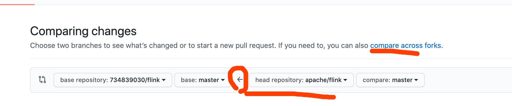

### 密码相关

- 记住密码
  `git config --global credential.helper store`
- 清空密码
  `git config --global --unset credential.helper`

### 仓库克隆

- 默认clone master

```
git clone url
```

- 克隆指定分支

```
git clone -b [branch_name] url
```

### 分支

- 本地和远程，`-a` 为同时显示远程仓库分支信息，不加`-a `只显示本地

```
git branch -a
```

- 检出并创建分支

```
git checkout -b localName
```

- 取远程分支，并创建本地对应分支

```
git checkout -b localName remoteName
```

### 查看美化后的log

```
git log --pretty=online -n 10
```

### 查看到reset后的log

```
git reflog --date=iso
```

### **关于git merge 和 git rebase**

- 主干合分支 用git merge

- 分支合并主干推荐用git rebase，可以消除同源线

- 拉取多人合作分支时候使用会减少`merge commits`

```
git pull --rebase 
```

- git pull 合并时候冲突，无法解决时候可以回到git pull 前的状态

```
git merge --abort
```

- 合并时候合并分支上差异的commits

```
git merge --squash [branch_name]
```

### 文件回退

1. 未add 的直接git checkout -- fileName
2. 已add 或者已经commit 的回到指定版本 git reset commit_id [fileName]，这个无法使用-hard,所以还需要再git
   checkout -- fileName ，这样就可以回到指定commit_id 的版本

### 回退

- 回退到指定commit，commit_id=HEAD 则为当前，如果是不添加hard ,commit_id 之前的内容会在工作区，需要add后重新commit.

```
git reset --hard commit_id 
```

1. git reset -mixed：此为默认方式，不带任何参数的git
   reset，这种方式，它回退到某个版本，只保留源码，回退commit和index信息，需要重新add.

2. git reset -soft:回退到某个版本，只回退了commit的信息，不会恢复到index file一级。如果还要提交，直接commit即可

3. git reset -hard 彻底回退到某个版本，本地的源码也会变成为上一个版本的内容

### Pull Request 技巧

Pull request 不仅可以用于向上游共享代码，也可以在fork 上游后，同步更新，如图注意箭头。

 


